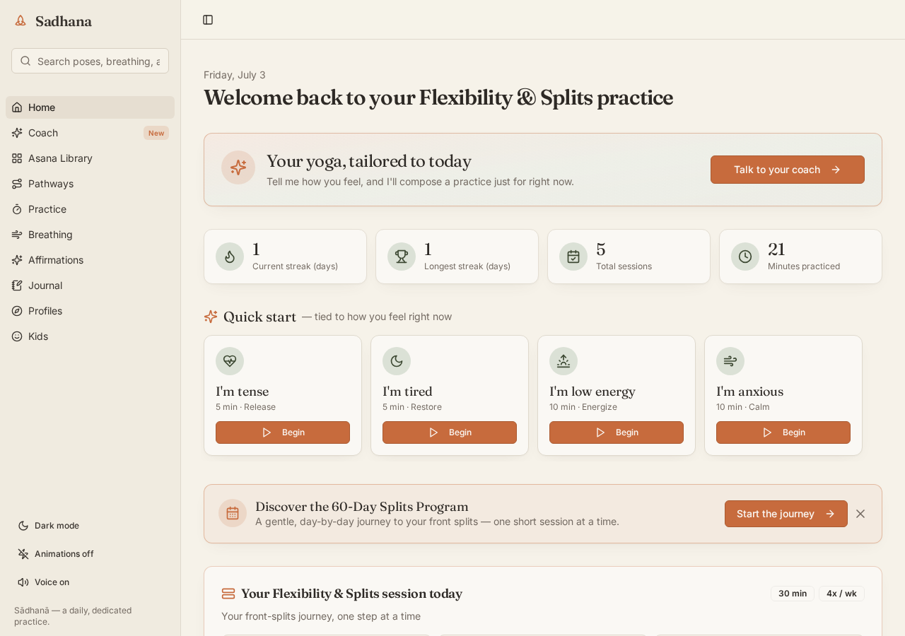

# Sadhana — a calm, guided yoga practice

A free, open-source yoga practice app with illustrated poses, guided voice
sessions, pathway programs, a kids section with story-based poses, and a
custom sequence builder.

**Live app:** https://sadhana-ou9m.onrender.com

[](https://render.com/deploy?repo=https://github.com/Tejaswinireddys/sadhana)




---

## What's inside

- **125 illustrated poses**, each with:
  - a warm illustrated instructor (consistent character across every pose)
  - calm female voice narration (pre-generated, no runtime AI cost)
  - Beginner / Intermediate / Advanced variations with props and cues
  - a "You'll feel this in…" stretch-zone callout
  - contraindications grouped as _avoid / modify / caution_
  - personal notes you can save per pose

- **Yoga Trainer**: answer four quick questions about body, energy, time, and
  need — get a personalized sequence that opens straight into a guided session

- **6 quick flows** for common needs: Morning Wake-Up, Desk Break, Neck &
  Shoulders, Post-Run, Sleep Wind-Down, Core Strong

- **7 sequenced flows**: Sun Salutation A, Sun Salutation B, Moon Salutation,
  Goddess Rising, Hormone Harmony, Moon Cycle Ease, Sacred Feminine Strength

- **4 seven-day challenges**: Hip Opening, Morning Ritual, Sleep Wind-Down,
  Backbend Journey — each with a day-grid tracker

- **Multi-week programs**: a 60-day daily plan toward full front splits with
  mobility check-ins and a journey grid, plus weekly Wheel Backbend and
  Full Forward Fold programs

- **Guided sessions**: a full-screen player that runs any flow with
  synchronized voice, illustrated pose, countdown timer, step captions,
  and automatic pose-to-pose transitions

- **Kids section**: 10 story-based poses ("The Friendly Snake", "The Tall Oak
  Tree"…), 4 breathing games (Balloon, Bunny, Bumblebee, Pinwheel), and a
  sticker collection. Parent-gated with a simple math question.

- **Six breathing techniques** with animated visualizers: Box, 4-7-8, Ujjayi,
  Nadi Shodhana, Bhramari, Kapalabhati

- **Practice tracking**: streaks, longest streak, total minutes, a 12-week
  heatmap, milestone celebrations (7, 30, 100 days…), mood check-ins before
  and after every session

- **Journal**: mood-tagged entries with search & filter, auto-created from
  every completed session

- **65 affirmations** organized around calm, strength, motherhood, clarity,
  self-love, and sleep

- **Custom sequence builder** — create and save your own flows from the
  full pose library and run them in guided mode

- **Global search** across every pose, breathing technique, pathway, and
  affirmation, with English + Sanskrit + forgiving fuzzy match

## Stack

- **Frontend** — React + Vite, Tailwind, shadcn/ui, wouter, TanStack Query
- **Backend** — Node + Express, Drizzle ORM, Postgres
- **Assets** — hand-composed pose illustrations and pre-generated voice
  narrations shipped as static files
- **Deployed on** — [Render](https://render.com) (web service) +
  [Supabase](https://supabase.com) (Postgres). Both free tiers.

## Run locally

```bash
git clone https://github.com/Tejaswinireddys/sadhana.git
cd sadhana
npm install
cp .env.example .env
# optional: set DATABASE_URL for Postgres. If unset, an in-memory store is used.
npm run dev
```

Then open http://localhost:5000

Practice data is scoped per browser via an anonymous device id (`X-Device-Id`).
Refreshing mid-session restores your queued poses and progress.

First-run onboarding, Settings (export/import, reminders, wipe), and an offline
banner are included. Pathway week progress advances only when sessions are logged.

## Deploy your own copy

The app is set up for one-click deploy on Render.

1. Fork this repo.
2. Create a free Postgres database (Supabase or Neon both work). Copy its
   connection string.
3. On [Render](https://render.com), click **New → Blueprint** and point it at
   your fork. Render will read `render.yaml` and provision the web service.
4. When prompted, set the `DATABASE_URL` environment variable to your
   Postgres connection string.
5. First boot creates all tables automatically.

The app runs on Render's free tier. Free-tier apps spin down after 15
minutes of inactivity; the first visit after that takes ~30 seconds to wake.

## Content credits

- Pose illustrations and voice narrations were composed for this project.
- Yoga instruction is drawn from traditional Hatha, Ashtanga, and modern
  therapeutic lineages. See individual pose descriptions for details.
- All content in this repository is licensed under MIT (see below); please
  practice with awareness of your own body and consult a certified teacher
  or medical professional for anything beyond a personal home practice.

## Contributing

Issues and pull requests are welcome. If you'd like to add a pose, a new
flow, or a new pathway, follow the pattern in `client/src/data/content.ts`.

## License

MIT — see `LICENSE`.
